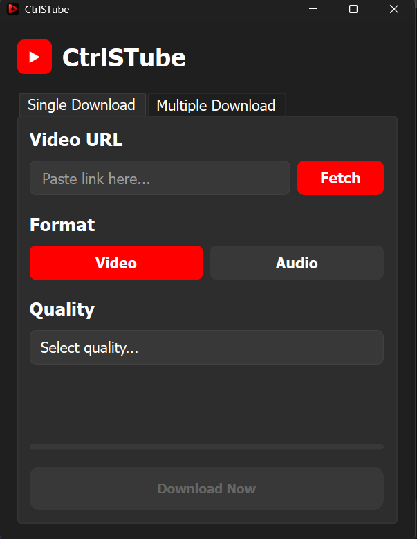

# CtrlSTube 📺⬇️



**CtrlSTube** is a powerful, modern, and user-friendly YouTube downloader application built with Python and PySide6. It offers a sleek graphical interface for downloading videos and audio from YouTube with support for high resolutions (up to 4K), batch processing, and automatic metadata fetching.

Designed for simplicity and performance, CtrlSTube leverages the robust `yt-dlp` engine and `FFmpeg` to ensure high-quality downloads and conversions.

---

## ✨ Key Features

*   **🎥 High-Quality Video Downloads**: Download videos in various resolutions including 4K (2160p), 2K (1440p), 1080p, 720p, and more.
*   **🎵 Audio Extraction**: Easily convert and download videos as high-quality MP3 audio files with metadata tagging.
*   **📦 Batch Processing**: Queue multiple videos or download entire playlists in one go.
*   **🚀 Smart Auto-Fetch**: Automatically detects and fetches video metadata (title, thumbnail, duration) when you paste a URL.
*   **🎨 Modern UI**: A clean, dark-themed interface built with PySide6, featuring responsive layouts and visual feedback.
*   **🛠️ Standalone Executable**: Can be built into a portable `.exe` file for easy distribution without requiring Python installation.
*   **⚡ FFmpeg Integration**: Uses FFmpeg for efficient format merging and conversion.

## 🛠️ Tech Stack

*   **Language**: [Python 3.8+](https://www.python.org/)
*   **GUI Framework**: [PySide6](https://pypi.org/project/PySide6/) (Qt for Python)
*   **Core Engine**: [yt-dlp](https://github.com/yt-dlp/yt-dlp)
*   **Media Processing**: [FFmpeg](https://ffmpeg.org/)
*   **Metadata**: [mutagen](https://pypi.org/project/mutagen/)
*   **Environment**: [python-dotenv](https://pypi.org/project/python-dotenv/)
*   **Testing**: [pytest](https://docs.pytest.org/)

## 📋 Prerequisites

Before you begin, ensure you have the following installed on your machine:

1.  **Python 3.8 or higher**: [Download Python](https://www.python.org/downloads/)
2.  **FFmpeg**: Required for video merging and audio conversion.
    *   **Windows**: [Download FFmpeg](https://ffmpeg.org/download.html) and add it to your system PATH.
    *   *Note: The `setup.bat` script checks for FFmpeg installation.*

## 🚀 Installation Guide

### Option 1: Automatic Setup (Windows)

We provide a comprehensive setup script to automate the process.

1.  **Clone the repository**:
    ```bash
    git clone https://github.com/mushfiqk47/ctrl-s-tube.git
    cd ctrl-s-tube
    ```

2.  **Run the setup script**:
    Double-click `setup.bat` or run it from the terminal:
    ```cmd
    setup.bat
    ```
    *This script will check for Python, create a virtual environment, install dependencies, and check for FFmpeg.*

### Option 2: Manual Installation

1.  **Clone the repository**:
    ```bash
    git clone https://github.com/mushfiqk47/ctrl-s-tube.git
    cd ctrl-s-tube
    ```

2.  **Create a virtual environment**:
    ```bash
    python -m venv venv
    # Windows
    venv\Scripts\activate
    # macOS/Linux
    source venv/bin/activate
    ```

3.  **Install dependencies**:
    ```bash
    pip install -r requirements.txt
    ```

## ⚙️ Configuration

1.  **Environment Variables**:
    Copy the example environment file to create your own `.env` file:
    ```bash
    cp .env.example .env
    # On Windows: copy .env.example .env
    ```

2.  **Edit `.env`**:
    Open `.env` in a text editor. If you plan to use Spotify integration features (if enabled), add your credentials:
    ```env
    SPOTIPY_CLIENT_ID=your_spotify_client_id
    SPOTIPY_CLIENT_SECRET=your_spotify_client_secret
    ```

## 💻 Usage

### Running the Application

*   **Using the Batch Script (Windows)**:
    Double-click `run.bat` to launch the application.

*   **Using Python**:
    Ensure your virtual environment is activated, then run:
    ```bash
    python main.py
    ```

### Building the Executable

To create a standalone `.exe` file that can run without Python:

1.  Run the build script:
    ```cmd
    build_exe.bat
    ```
2.  Find the executable in the `dist/` folder (e.g., `dist/CtrlSTube.exe`).

## 📂 Folder Structure

```text
ctrl-s-tube/
├── core/               # Core application logic and controllers
├── services/           # Business logic (YouTube, FFmpeg services)
├── ui/                 # GUI implementation (PySide6 windows & widgets)
├── utils/              # Helper functions, config, and constants
├── tests/              # Unit tests
├── main.py             # Application entry point
├── requirements.txt    # Python dependencies
├── setup.bat           # Automated setup script
├── run.bat             # Application launcher script
├── build_exe.bat       # PyInstaller build script
└── .env.example        # Environment variables template
```

## 🤝 Contributing

Contributions are welcome! If you have suggestions or find bugs, please open an issue or submit a pull request.

1.  Fork the repository.
2.  Create your feature branch (`git checkout -b feature/AmazingFeature`).
3.  Commit your changes (`git commit -m 'Add some AmazingFeature'`).
4.  Push to the branch (`git push origin feature/AmazingFeature`).
5.  Open a Pull Request.

## 📄 License

This project is licensed under the **MIT License**. See the [LICENSE](LICENSE) file for details.

---

Made with ❤️ by [Md. Mushfiq Kabir](https://github.com/mushfiqk47)
